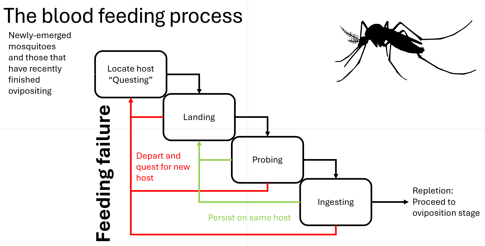

```{r setup, include=FALSE, echo = FALSE}
knitr::opts_chunk$set(
  echo = FALSE, cache = FALSE, warning = FALSE, fig.pos = "H",
  out.extra = ""
)
# Load Libraries----------------------------------------------------------------
library(matrixdist)
library(tidyverse)
library(matlib) # for a bunch of matrix operations
library(cowplot)
library(PhaseTypeR) # to create and simulate phase type distributions
library(PhaseType) # to fit structured phase type distributions
library(mapfit) # alternative way to fit phase type distributions
library(reshape2)
library(Matrix)
library(corrplot)
library(GGally)
library(lhs) # easy Latin Hypercube sampling
library(actuar) # to create and simulate phase type distributions
library(knitr) # to make nice tables
library(latex2exp) # to display TeX
library(printr) # to display TeX nicely
library(ggbeeswarm) # make "beeswarm" distribution figures
library(data.table)
library(progressr) # Progress bars
library(doFuture) # Faster parallel processing
library(philentropy)
library(cols4all) # Colorblind-friendly palettes for ggplot

# Plot settings ----

# Set theme
# theme_set(theme_minimal(10))

# Load required functions ----
source("code/utilities.R")


```
# Introduction
Mosquito-borne diseases are a big problem.

Multiple blood-feeding, in its many forms, is a phenomenon that may multiply the transmission of mosquito-borne parasites.

## Mechanisms and processes of mosquito blood-feeding
Descriptions and diagrams
```{r figure-1, out.width = "400px", fig.cap='Cartoon of the mosquito blood-feeding process.'}

```


# Methods

## Box: Modeling processes with phase-type distributions

## Model formulation

## Parameterization

We assume the following parameter values for the biting parameters
```{r biting-parameters, message=FALSE, warning=FALSE, fig.cap='Table 1: Blood-feeding parameters'}

# Define phase type distribution
# Landing
pL = 0.7
lL = 0.1 # 10 minutes

# Probing
pP = 0.8
lP = 0.2 # 5 minutes

# Ingesting
pG = 0.9 #0.75
lG = 1 # 1 minutes

# Fleeing
f = 0.66

param_table = tibble(
  name = c("p_L", "lambda_L", "p_P", "lambda_P", "p_G", "lambda_G", "f"),
  Symbol = c("$p_L$", "$\\lambda_L$", "$p_P$", "$\\lambda_P$", "$p_G$", "$\\lambda_G$", "$f$"),
  Description = c("Probability of progressing from landing to probing ",
                  "Exit rate from landing stage (per minute)", 
                  "Probability of progressing from probing to ingesting",
                  "Exit rate from probing stage (per minute)",
                  "Probability of progressing from ingesting to ovipositing",
                  "Exit rate from ingestion stage (per minute)",
                  "Probability of seeking a new vertebrate host given feeding failure"
  ),
  value = c(pL, lL, pP, lP, pG, lG, f)
)

kable(select(param_table, -name) %>% rename(Value = value))
```
and the following for the remaining model parameters
```{r other-parameters, message=FALSE, warning=FALSE, fig.cap='Table 2: All other parameters'}
# !!! temporary values for testing
eta = 1/(6 * 1440) # 6 days for infection to develop in vector
mu = 1/(21 * 1440) # 20 day lifespan for vector
gamma = 1/(3 * 1440) # rate of return from oviposition to blood-feeding (3 days)
gammaH = 1/(7 * 1440) # rate of recovery in hosts (7 days)
muH = 1/(365.25 * 65 * 1440) # host mortality rate (65 years)
KH = 10^7 # host population density

KL = 300
rhoL = 1/(12 * 1440)
muL = 1/(20 * 1440)
varPhi = 3 / 1440

# Epidemiological parameters
epi_parms = tibble(betaP = 1, betaG = 1, betaH = 1, betaV = 1)

# Questing rate needs to be set separately
lambdaQ = 1 / ((1/3) * 1440) # questing takes one third of a day

parameters = tibble(
  eta = eta, mu = mu, gamma = gamma, gammaH = gammaH, muH = muH, KH = KH, KL = KL, rhoL = rhoL, muL = muL, varPhi = varPhi, epi_parms, lambdaQ = lambdaQ
)

nice_parameter_table = tibble(
  pivot_longer(parameters, everything()),
  Symbol = c("$\\eta$", "$\\mu$", "$\\gamma$", "$\\gamma_H$", "$\\mu_H$", "$K_H$", "$K_L$", "$\\rho_L$", "$\\mu_L$", "$\\varphi$", "$\\beta_P$", "$\\beta_G$", "$\\beta_H$", "$\\beta_V$", "$\\lambda_Q$"),
  Description = c("Extrinsic incubation rate", 
                  "Mosquito mortality rate",
                  "Return to blood-feeding rate",
                  "Host recovery rate", 
                  "Host mortality rate", 
                  "Host carrying capacity",
                  "Larval mosquito carrying capacity",
                  "Larval mosquito maturation rate",
                  "Larval mosquito mortality rate",
                  "Eggs per female per day",
                  "Probing transmission probability",
                  "Ingestion transmission probability",
                  "To-host transmission probability",
                  "To-mosquito transmission probability",
                  "Questing rate"
  )
)

kable(select(nice_parameter_table, -name) %>%  relocate(Symbol, Description, Value = value), digits = c(0,0,2))
```

## Simulation

We simulate a set of measurements of the time it takes for a single mosquito seeking a blood meal on a specific host to no longer seek a blood meal. 
This data is heavily censored: we don't have information on whether the mosquito successfully completed a blood meal or if it was disrupted at any point in the feeding process. 
This simulation does not take into account the time that the mosquito spends questing, that is, we assume it has already located a suitable host to feed upon. 


```{r simulate-data, message=FALSE, warning=FALSE}

# subintensity matrix
set_A = matrix(c(
  (-1 + (1 - f) * (1- pL)) * lL, pL * lL, 0,
  (1 - f) * (1 - pP) * lP, -lP, pP * lP,
  (1 - f) * (1 - pG) * lG, 0, -lG), ncol = 3, byrow = TRUE) 
set_alpha = c(1, 0, 0) # initial probability vector
ph = PH(set_A, set_alpha)

# Get 100 random samples from the distribution
direct_samps = rphtype(10000, set_alpha, set_A)

# write_csv(data.frame(direct_samps), "data/direct_samples.csv")

# Simulated data set
# simulated_data = read_csv("data/direct_samples.csv") 
# simulated_data = read_csv("data/noQ_data_continuous.csv")
# total_sample_size = length(simulated_data$Out_time)
sample_size = 10000

test_data = direct_samps[1:sample_size]
```

These parameters lead to a phase-type distributed waiting time for blood-feeding parameterized by the sub-intensity matrix $A$ given by
\[
A = \begin{bmatrix}-\lambda_{L}+\left(1-f\right)\left(1-p_{L}\right)\lambda_{L} & p_{L}\lambda_{L} & 0\\
\left(1-f\right)\left(1-p_{P}\right)\lambda_{P} & -\lambda_{P} & p_{p}\lambda_{P}\\
\left(1-f\right)\left(1-p_{G}\right)\lambda_{G} & 0 & -\lambda_{G}
\end{bmatrix}  = \begin{bmatrix} `r set_A[1,1]` & `r set_A[1,2]` & 0\\
`r set_A[2,1]` & `r set_A[2,2]` & `r set_A[2,3]`\\
`r set_A[3,1]` & 0 & `r set_A[3,3]`
\end{bmatrix}
\]
and initial vector $\alpha = \left(1,0,0\right)$.

This distribution takes the following approximate shape and has a mean of `r mean(direct_samps)` minutes and standard deviation of `r sd(direct_samps)` minutes. The 5\% and 95\% quantiles are at `r quantile(direct_samps, 0.05)` minutes and `r quantile(direct_samps, 0.95)` minutes, respectively. 

```{r plot-simulation}
ggplot(as.data.frame(x = direct_samps), aes(x=direct_samps)) +
  geom_density(fill = "blue", alpha = 0.5) + 
  scale_x_continuous("Time before ending blood-feeding", expand = c(0,0)) +
  scale_y_continuous("Density", expand = c(0,0))
```
We will use this simulated data set as a proxy for real data that might be collected to study the effects of multiple blood-feeding on transmission.

# Results: Equilibrium analysis

## Basic reproduction number

## Existence and stability of equilibria


# Results: Sensitivity analysis

## Relationships among reproduction numbers and blood-feeding parameters
```{r R0-monotonicity-plots, message=FALSE, warning=FALSE, fig.cap = 'The basic reproduction and reproductive numbers as functions of the biting rate parameters. In each figure, only the labeled parameter is being varied. All other parameters are as in Tables 1 and 2.'}

# Plot R0 vs. each biting rate parameter
# - curves for varying baseline parameters
# - points for posterior sample sets, colored by type (just do empirical(1) and mechanistic)

# Posterior R0 PRCC distribution calculations

#
mu = 1 / (21 * 1440)
eta = 1 / (6 * 1440)
# !!! this is explicit in the R0 calculation function lambdaQ = 1 / ((1/3) * 1440) # questing takes on average one third of a day
gamma = 1/(3 * 1440) # rate of return from oviposition to blood-feeding (3 days) - resting - laying - resting
parameters = tibble(
  eta = eta, mu = mu, gamma = gamma, gammaH = gammaH, muH = muH, KH = KH, KL = KL, rhoL = rhoL, muL = muL, varPhi = varPhi, epi_parms, lambdaQ = lambdaQ
)

# Set up parameter set variation
param_set = param_table %>% select(name, value) %>% pivot_wider()

sens_range = 1
num_vary = 100
num_params = 7
full_param_set = data.frame(matrix(rep(0, num_vary, num_params), num_vary, num_params))

for (j in 1:num_params) {
  
  if (colnames(param_set[j]) %in% c("f", "p_L", "p_P", "p_G")) {
    max_val = min(1,  (1 + sens_range))  / param_set[j][[1]]
  } else {max_val = 1+sens_range}
  
  vary_range = seq(max(0, (1 - sens_range)), max_val, length.out = num_vary)
  
  vary_params = vary_range * as.double(select(param_set, colnames(param_set[j])))
  
  param_name = as.character(colnames(param_set[j]))
  
  full_param_set[,j] = vary_params
}

colnames(full_param_set) = colnames(param_set)
# full_param_set <- mutate(full_param_set, type = "vary") %>%
#   rbind(mutate(param_set, type = "baseline"))

R0_sensitivity_df <- tibble(R0 = as.double(), R = as.double(),
                            p_L = as.double(), lambda_L = as.double(), p_P = as.double(),
                            lambda_P = as.double(), p_G = as.double(), f = as.double(),
                            variable_parm = as.character())
# Calculate R0 across varied baseline parameters
for (j in 1:num_params) {
  for (i in 1:num_vary) {
    vary_params = param_set
    vary_params[j] = full_param_set[i,j]
    PH_mat = mech_params_to_mat(vary_params)
    Rs = R0_calc(PH_mat, "Mechanistic", parameters, provide_params = vary_params)
    R0_sensitivity_df <- rbind(R0_sensitivity_df,
                               tibble(Rs, vary_params, variable_parm = colnames(vary_params)[j]))
  }
}

test = R0_sensitivity_df %>%
  pivot_longer(cols = -c(R0, R, variable_parm)) %>%
  filter(variable_parm == name) %>% select(-variable_parm)

# # Calculate R0 across fitted parameter sets
# # Calculate R0 values
# mech_R0_df <- tibble(R = as.double(), R0 = as.double(),
#                      p_L = as.double(), lambda_L = as.double(), p_P = as.double(),
#                      lambda_P = as.double(), p_G = as.double(), f = as.double())
#
# for (i in 1:dim(mech_res$samples)[1]) {
#   PH_mat = mech_params_to_mat(mech_params_df[i,])
#
#   Rs = R0_calc(PH_mat, "Mechanistic", parameters, provide_params = mech_params_df[i,])
#   mech_R0_df <- rbind(mech_R0_df,
#                       tibble(Rs, select(mech_params_df[i,], lambda_L:f)))
# }
#
# test2 <- mech_R0_df %>%
#   filter(between(lambda_L, range(R0_sensitivity_df$lambda_L)[1], range(R0_sensitivity_df$lambda_L)[2])) %>%
#   filter(R > 0, R0 > 0) %>%
#   pivot_longer(cols = -c(R0, R)) %>%
#   filter(between(R0, range(test$R0)[1], range(test$R0)[2]))

base_Rs = R0_calc(mech_params_to_mat(param_set), "Mechanistic", parameters, provide_params = param_set)

base_points = cbind(base_Rs, param_set) %>%
  pivot_longer(cols = -c(R0, R))

R0_mono_plot <- test %>%
  ggplot(aes(x = value, y = R0)) +
  geom_line(lwd = 1) +
  # geom_point(data = test2, aes(color = "mech"), alpha = 0.3) +
  geom_point(data = base_points, aes(color = "actual"), size = 3) +
  scale_color_manual("Type",
                     breaks = c("actual"="green", "mech"="blue"),
                     values = c("actual"="green", "mech"="blue"),
                     labels = c("actual", "mech")) +
  facet_wrap(~name, scales = "free") +
  ggtitle("Variation of R0 with respect to biting rate parameters") +
  theme_minimal_grid()
R0_mono_plot

Rs_mono_plot <- test %>%
  ggplot(aes(x = value, y = R)) +
  geom_line(lwd = 1) +
  # geom_point(data = test2, color = "blue", alpha = 0.3) +
  facet_wrap(~name, scales = "free") +
  theme_minimal_grid()
Rs_mono_plot
```

## PRCCs of R0 or R and blood-feeding parameters

Table of values
```{r baseline-prcc-table, message=FALSE, warning=FALSE, fig.cap = 'Table 3: Baseline PRCC values'}

# Plot baseline PRCC values
read_rds("./data/PRCC_variance_test.rds") %>% 
  filter(iterate == 1) %>% 
  ggplot() +
  geom_col(aes(x = name, y = PRCC_R0)) +
  ggtitle("Baseline PRCC results") +
  scale_x_discrete("") + 
  scale_y_continuous("R0 PRCC values") + #, limits = c(-1,1)) +
  theme_minimal_hgrid(10)

```
```{r R0-PRCCs-func, message=FALSE, warning=FALSE}

# Plot R0 - biting rate parameter PRCCs as the ratio of EIP and lifespan is varied

# For each row, keep EIP / lifespan fixed
# - one set of bars for fixed lifespan and varied EIP
# - one set of bars for fixed EIP and varied lifespan

R0_PRCC_func <- function(vary_parameters, progress_bool = FALSE) {
  sens_res = 10000
  sens_range = 1
  num_params = dim(param_table)[1] + 1
  param_set = param_table %>% select(name, value) %>% pivot_wider() %>%
    mutate(dummy = runif(1))
  LHS_mat = randomLHS(sens_res, num_params)
  transformed_LHS_mat <- matrix(nrow = nrow(LHS_mat), ncol = ncol(LHS_mat))
  # Set up parameter set variation
  
  for (j in 1:num_params) {
    
    if (colnames(param_set[j]) %in% c("f", "p_L", "p_P", "p_G")) {
      max_val = min(1,  (1 + sens_range) * param_set[j][[1]])
    }
    
    transformed_LHS_mat[,j] = qunif(LHS_mat[,j],
                                    min = (1 - sens_range) * param_set[j][[1]],
                                    max = max_val)
  }
  
  sens_params = as_tibble(transformed_LHS_mat)
  names(sens_params) = colnames(param_set[1:(num_params)])
  
  R0_sensitivity_df = data.frame(sens_params[0,],
                                 R0 = as.double(), R = as.double())
  
  my_multisession = tweak(multisession, workers = availableCores())
  plan(list(my_multisession, sequential))
  plan(multisession, workers = availableCores())
  parameter_indices = 1:dim(vary_parameters)[1]
  LHS_indices = 1:dim(sens_params)[1]
  
  if (progress_bool == TRUE) {
    # Set up progress bar
    progressr::handlers(global = TRUE)
    progressr::handlers("cli")
    progress_length = length(parameter_indices)
    progress_chunk = 1#if_else(progress_length < 10, 1, 10)
    p = progressor(along = 1:(progress_length / progress_chunk))
  }
  
  out = foreach(
    i = parameter_indices,
    # .inorder = FALSE,
    .combine = "rbind") %dofuture% {
      # Iterate progress bar
      if (progress_bool == TRUE) {
        if (i %% progress_chunk == 0) p(sprintf("i=%g", parameter_indices[i]))
      }
      
      R0_sensitivity_df = foreach(
        k = LHS_indices,
        .combine = "rbind") %dofuture% {
          # PH_mat = mech_params_to_mat(sens_params[k,])
          Rs = R0_calc(PH_mat = NULL, "Mechanistic", vary_parameters[i,], provide_params = sens_params[k,])
          data.table(sens_params[k,], Rs)
        }
      
      temp = R0_sensitivity_df %>%
        # Remove infeasible parameter sets
        filter(R > 0) %>%
        # Replace R0 with 0 when mosquito population is inviable
        # mutate(R0 = ifelse(R < 1, 0 , R0)) %>%
        cor(method = "spearman") %>%
        as.data.frame() %>%
        select(R0, R) %>%
        rownames_to_column() %>%
        rename(name = rowname, PRCC_R0 = R0, PRCC_R = R) %>%
        filter(!(name %in% c("R0", "R")))
      temp2 = cbind(temp, vary_parameters[i,])
    }
  plan(sequential)
  return(out)
}

R0_PRCC_df = data.table(name = as.character(), PRCC_R0 = as.double(), PRCC_R = as.double())
```

```{r PRCC-calculations, message=FALSE, warning=FALSE}

PRCC_calc = FALSE

if (PRCC_calc) {
  
  # Test whether R0 is monotonic for each biting rate parameter over the LHS samples
  sens_res = 10000
  sens_range = 1
  num_params = dim(param_table)[1] + 1
  param_set = param_table %>% select(name, value) %>% pivot_wider() %>%
    mutate(dummy = runif(1))
  LHS_mat = randomLHS(sens_res, num_params)
  transformed_LHS_mat <- matrix(nrow = nrow(LHS_mat), ncol = ncol(LHS_mat))
  # Set up parameter set variation
  for (j in 1:num_params) {
    if (colnames(param_set[j]) %in% c("f", "p_L", "p_P", "p_G")) {
      max_val = min(1,  (1 + sens_range) * param_set[j][[1]])
    }
    transformed_LHS_mat[,j] = qunif(LHS_mat[,j],
                                    min = (1 - sens_range) * param_set[j][[1]],
                                    max = max_val)
  }
  
  sens_params = as_tibble(transformed_LHS_mat)
  names(sens_params) = colnames(param_set[1:(num_params)])
  
  R0_sensitivity_df = data.frame(sens_params[0,],
                                 R0 = as.double(), R = as.double())
  parameter_indices = 1:dim(parameters)[1]
  LHS_indices = 1:dim(sens_params)[1]
  
  mono_R0_df = foreach(
    k = LHS_indices,
    .combine = "rbind") %do% {
      # PH_mat = mech_params_to_mat(sens_params[k,])
      Rs = R0_calc(PH_mat = NULL, "Mechanistic", parameters, provide_params = sens_params[k,])
      data.table(sens_params[k,], Rs)
    }
  
  write_rds(mono_R0_df, "./data/mono_R0_vals.rds")
  
  # Test whether there is detectable variation in PRCC values
  # If there is, then need to increase the resolution of the Latin Hypercube sampling
  print("Calculating variation in PRCC values")
  rep_params = parameters
  for (i in 1:100) {rep_params = rbind(rep_params, parameters)}
  
  PRCC_var_test = R0_PRCC_func(rep_params, progress_bool = TRUE) %>% 
    mutate(iterate = row_number())
  
  write_rds(PRCC_var_test, "./data/PRCC_variance_test.rds")
  
  # Calculate PRCCs as EIP is varied
  print("Calculating PRCCs as EIP is varied")
  parameters = tibble(
    eta = eta, mu = mu, gamma = gamma, gammaH = gammaH, muH = muH, KH = KH, KL = KL, rhoL = rhoL, muL = muL, varPhi = varPhi, epi_parms, lambdaQ = lambdaQ
  )
  vary_parameters <- select(parameters, -eta) %>%
    cross_join(tibble(eta = 1/(1440 * seq(1, 28, length.out = 14))))
  
  
  R0_PRCC_df_EIP = R0_PRCC_func(vary_parameters, progress_bool = TRUE) %>% 
    select(name, PRCC_R0, PRCC_R, eta)
  gc(verbose = FALSE)
  
  write_rds(R0_PRCC_df_EIP, "./data/vary_EIP_PRCC_vals.rds")
  
  # Calculate PRCCs as lifespan is varied
  print("Calculating PRCCs as lifespan is varied")
  parameters = tibble(eta = eta, mu = mu, gamma = gamma, gammaH = gammaH, 
                      muH = muH, KH = KH, KL = KL, rhoL = rhoL, muL = muL, 
                      varPhi = varPhi, epi_parms, lambdaQ = lambdaQ)
  
  vary_parameters <- select(parameters, -mu) %>%
    cross_join(tibble(mu = 1/(1440 * seq(1, 60, length.out = 3 * 60))))
  R0_PRCC_df_mu = R0_PRCC_func(vary_parameters, progress_bool = TRUE)
  gc(verbose = FALSE)
  
  write_rds(R0_PRCC_df_mu, "./data/vary_lf_PRCC_vals.rds")
  
  # Calculate PRCCs as questing duration is varied
  print("Calculating PRCCs as questing duration is varied")
  parameters = tibble(eta = eta, mu = mu, gamma = gamma, gammaH = gammaH, 
                      muH = muH, KH = KH, KL = KL, rhoL = rhoL, muL = muL, 
                      varPhi = varPhi, epi_parms, lambdaQ = lambdaQ)
  
  vary_parameters <- select(parameters, -lambdaQ) %>%
    cross_join(tibble(lambdaQ = 1/(1440 * seq(1/60, 10, length.out = 2 * 60))))
  
  R0_PRCC_df_lambdaQ = R0_PRCC_func(vary_parameters, progress_bool = TRUE)
  gc(verbose = FALSE)
  
  write_rds(R0_PRCC_df_lambdaQ, "./data/vary_lambdaQ_PRCC_vals.rds")
}

```

```{r R0-mono-check, message=FALSE, warning=FALSE, fig.cap = 'Test for the monotonicity of R0 with respect to Latin hypercube sampled blood-feeding parameters.'}
# Visual check for monotonicity
read_rds("./data/mono_R0_vals.rds") %>%
  filter(R > 1) %>%
  pivot_longer(cols = -c(R0,R)) %>%
  ggplot(aes(x = value, y = log(R0))) +
  geom_point(alpha = 0.1) +
  facet_wrap( ~ name, scales = "free") +
  theme_minimal_grid()
```

```{r PRCC_var_test, message=FALSE, warning=FALSE, fig.cap = 'Diagnostic test of the variation in PRCC values using 10 independent calculations'}
# Plot multiple PRCC estimates to assess variability and whether LHS resolution should be increased

read_rds("./data/PRCC_variance_test.rds") %>%
  select(name, PRCC_R0, iterate) %>%
  # pivot_wider(names_from = name, values_from = PRCC_R0) %>%
  ggplot(aes(x = name, y = PRCC_R0)) +
  geom_violin() +
  geom_beeswarm(alpha = 0.3) +
  geom_hline(yintercept = 0) +
  theme_minimal_grid()

```

<!-- ```{r R0-mech-PRCCs, message=FALSE, warning=FALSE, include=FALSE} -->
<!-- # Calculate PRCCs of R0 to mechanistic parameters -->
<!-- # Posterior R0 PRCC distribution calculations -->
<!-- library(doFuture) # Faster parallel processing -->
<!-- R0_PRCC_mech = R0_PRCC_func(mech_params_df) -->

<!-- ``` -->

<!-- ```{r R0-PRCC-mech-dist-plot} -->
<!-- R0_PRCC_mech %>%  -->
<!--   select(-iterate) %>%  -->
<!--   ggplot(aes(x = as.factor(rowname), y = R0)) + -->
<!--   geom_quasirandom(alpha = 0.66, stroke = 0, color = "lightblue", shape = 16) + -->
<!--   geom_violin(color = "blue", fill = NA) + -->
<!--   geom_hline(aes(yintercept = 0), color = "red") + -->
<!--   scale_x_discrete("Parameter") + -->
<!--   scale_y_continuous("R0 PRCC values across fitted mechanistic parameters") -->
<!-- ``` -->

<!-- ```{r RepNum-PRCC-mech-dist-plot} -->
<!-- R0_PRCC_mech %>%  -->
<!--   select(-iterate) %>%  -->
<!--   ggplot(aes(x = as.factor(rowname), y = R)) + -->
<!--   geom_quasirandom(alpha = 0.66, stroke = 0, color = "lightblue", shape = 16) + -->
<!--   geom_violin(color = "blue", fill = NA) + -->
<!--   geom_hline(aes(yintercept = 0), color = "red") + -->
<!--   scale_x_discrete("Parameter") + -->
<!--   scale_y_continuous("Mosq. pop. RepNum PRCC values across fitted mechanistic parameters") -->
<!-- ``` -->

The global sensitivity of $R_0$ to the biting rate parameters does not change when the extrinsic incubation period is increased.
```{r R0-PRCC-vary-EIP, message=FALSE, warning=FALSE}

read_rds("./data/vary_EIP_PRCC_vals.rds") %>%
  mutate(EIP = 1 / (1440 * eta)) %>%
  ggplot(aes(x = EIP, y = PRCC_R0, color = name)) +
  # geom_point(alpha = 0.3) +
  geom_line(lwd = 1) +
  geom_hline(aes(yintercept = 0), color = "red") +
  scale_color_manual("Parameter",
                     values = rev(c(c4a("miscs.okabe", 7),"black")),
                     breaks = rev(c("p_L", "lambda_L", "p_P", "lambda_P", "p_G", "lambda_G", "f", "dummy"))
  )+
  scale_x_continuous("Extrinsic incubation period (days)", expand = c(0,0)) +
  scale_y_continuous("R0 PRCC value", expand = c(0,0), limits = c(-1,1)) +
  ggtitle("R0 PRCCs as EIP is varied") +
  theme(axis.ticks.x = element_text(size = 6)) +
  theme_minimal_grid()

```
Similarly, changing the lifespan of the mosquito also does not impact the global sensitivity of $R_0$ to the biting rate parameters.
```{r R0-PRCC-vary-mu, message=FALSE, warning=FALSE}

read_rds("./data/vary_lf_PRCC_vals.rds") %>%
  mutate(lf = 1/(1440 * mu)) %>%
  ggplot(aes(x = lf, y = PRCC_R0, color = name)) +
  # geom_point(alpha = 0.3) +
  geom_line(lwd = 1) +
  geom_hline(aes(yintercept = 0), color = "red") +
  scale_color_manual("Parameter",
                     values = rev(c(c4a("miscs.okabe", 7),"black")),
                     breaks = rev(c("p_L", "lambda_L", "p_P", "lambda_P", "p_G", "lambda_G", "f", "dummy"))
  )+
  scale_x_continuous("Mosquito lifespan (days)", expand = c(0,0)) +
  scale_y_continuous("R0 PRCC value", expand = c(0,0), limits = c(-1,1)) +
  ggtitle("R0 PRCCs as mosquito lifespan is varied") +
  theme(axis.ticks.x = element_text(size = 6)) +
  theme_minimal_grid()

```
Let's see what happens when we increase the questing time
```{r R0-PRCC-vary-lambdaQ, message=FALSE, warning=FALSE}

read_rds("./data/vary_lambdaQ_PRCC_vals.rds") %>%
  mutate(dQ = 1/(1440 * lambdaQ)) %>%
  ggplot(aes(x = dQ, y = PRCC_R0, color = name)) +
  # geom_point(alpha = 0.3) +
  geom_line(lwd = 1) +
  geom_hline(aes(yintercept = 0), color = "red") +
  scale_color_manual("Parameter",
                     values = rev(c(c4a("miscs.okabe", 7),"black")),
                     breaks = rev(c("p_L", "lambda_L", "p_P", "lambda_P", "p_G", "lambda_G", "f", "dummy"))
  )+
  scale_x_continuous("Mosquito questing duration (days)", expand = c(0,0), 
                     trans = 'log10') +
  scale_y_continuous("R0 PRCC value", expand = c(0,0), limits = c(-1,1)) +
  ggtitle("R0 PRCCs as mosquito questing duration is varied") +
  theme(axis.ticks.x = element_text(size = 6)) +
  theme_minimal_grid()

```

# Results: Uncertainty analysis

## Fitting phase-type distributions
We first need to estimate the parameters of the model from the available data. 
Because we are not certain of appropriate way to model the processes of multiple blood-feeding, we consider three types of models: empirical, phenomenological, and mechanistic. 
For the empirical model, we don't assume to know the actual underlying processes, essentially considering them a black box. We will consider three orders for this model: 1 (corresponding to an exponential distribution), 3 (for comparison with the mechanistic model), and 5. 
The phenomenological model focuses are getting the phenomenon right: that there is some disruption causing mosquitoes to take multiple blood meals. For now, we consider model orders of 3, 4, and 5.
Finally, the mechanistic model incorporates what we know about the elements of the mosquito blood-feeding processes to directly estimate the parameters. These parameters align in definition with those used to simulate the test data. 

For each model class, we use an expectation-maximization algorithm that uses Markov-chain Monte Carlo sampling to perform Bayesian inference on the parameter values. This means that we obtain posterior distributions for each of the parameters (or equivalently the matrix elements of $A$). 

### Empirical model

```{r empirical-fitting, message=FALSE, warning=FALSE, echo = FALSE}

redo_fitting = 0

if (redo_fitting) {
  
  orders = c(1,3,5)
  out_mats = lapply(rep(orders, 1000), function(x) matrix(NA, x, x))
  AIC_table = tibble(order = as.integer(), logLik = as.double(), AIC = as.integer())
  
  num_samples = 10000
  
  emp_mats_df <- tibble(iterate = as.integer(), order = as.integer(), 
                        row_index = as.integer(), col_index = as.integer(), 
                        value = as.double(), logLik = as.double())
  
  for (PH_order in orders) {
    print(paste0("PH Order: ", PH_order, " out of ", length(orders)))
    num_transient_states = PH_order
    
    # alpha is always set to (1,0,...,0)
    alpha = rep(0, num_transient_states); alpha[1] = 1
    
    priors <- uninf_priors_func(mean(test_data) / num_transient_states, var(test_data), num_transient_states)
    # Gamma prior: reciprocal scale hyperparameters (one per matrix row)
    nu <- priors$nu #rep(1/mean(test_data), num_states)
    zeta <- priors$zeta[1:num_transient_states]
    
    
    res <- phtMCMC(test_data,
                   states = num_transient_states,
                   beta = alpha,
                   nu = nu, zeta = zeta,
                   n = num_samples,
                   mhit = 100000)
    
    for (i in 1:dim(res$samples)[1]) {
      PH_mat = reshape_phtMCMC(res$samples[i,], "Empirical")
      logLik = PHlikelihood(test_data, PH_mat)
      
      PH_mat_df <- as.data.frame(PH_mat) %>% 
        rownames_to_column() %>% 
        pivot_longer(-rowname, names_pattern = "([0-9]+).*$", names_to = "col_index") %>% 
        mutate(row_index = as.double(str_extract(rowname, "([0-9]+).*$")),
               col_index = as.double(col_index)) %>% 
        select(-rowname)
      
      # Collect mechanistic parameters
      emp_mats_df <- add_row(emp_mats_df, order = PH_order,
                             iterate = i, PH_mat_df, logLik = logLik)
      
    }
    
  }
  
  write_csv(emp_mats_df, "./data/empirical_fits.csv")
} else {
  emp_mats_df <- read_csv("./data/empirical_fits.csv", show_col_types = FALSE)
}
```
We can compare the waiting time distributions derived from these models with our simulated data.

```{r empirical-compare, echo = FALSE, results = 'hide'}

calc_dist_compare_stats = 0

if (calc_dist_compare_stats) {
  # Function: stats compiler
  PH_stats_func <- function(PH_order) {
    # Set up stats comparison table
    stats_compare_df <- tibble(order = as.integer(), mean = as.double(), 
                               median = as.double(), sd = as.double(), 
                               quantile_05 = as.double(), quantile_95 = as.double())  
    num_transient_states = PH_order
    
    # alpha is always set to (1,0,...,0)
    alpha = rep(0, num_transient_states); alpha[1] = 1
    
    priors <- uninf_priors_func(mean(test_data) / num_transient_states, var(test_data), num_transient_states)
    # Gamma prior: reciprocal scale hyperparameters (one per matrix row)
    nu <- priors$nu #rep(1/mean(test_data), num_states)
    zeta <- priors$zeta[1:num_transient_states]
    
    res <- phtMCMC(test_data, 
                   states = num_transient_states, 
                   beta = alpha, 
                   nu = nu, zeta = zeta, 
                   n = num_samples,
                   mhit = 10000)
    order_samples = res$samples
    
    for (i in 1:dim(res$samples)[1]) {
      out_mat = reshape_phtMCMC(order_samples[i,], "Empirical")
      order_times = rphtype(1000, alpha, out_mat)
      stats_compare_df <- add_row(stats_compare_df, order = PH_order, 
                                  mean = mean(order_times), 
                                  median = median(order_times), 
                                  sd = sd(order_times), 
                                  quantile_05 = quantile(order_times, 0.05), 
                                  quantile_95 = quantile(order_times, 0.95)
      )
    }
    return(stats_compare_df)
  } 
  
  stats_compare_df <- rbind(PH_stats_func(1),PH_stats_func(3), PH_stats_func(5))
  
  
  simul_stats = tibble(order = NA, name = c("mean", "median", "sd", "quantile_05", "quantile_95"), 
                       value = c(mean(direct_samps), median(direct_samps), sd(direct_samps), 
                                 quantile(direct_samps, .05), quantile(direct_samps, .95))
  )
  
  
  # Plot a comparison of the statistics
  stats_compare_df %>% 
    pivot_longer(cols = -order) %>% 
    filter(value < 60) %>% # filter out ridiculously high values exceeding an hour
    ggplot(aes(x = order, y = value)) +
    geom_quasirandom(alpha = 0.3, stroke = 0, shape = 16, size = 1) +
    # Add lines showing the value from the simulated data
    geom_hline(data = simul_stats, aes(yintercept = value), color = 'blue') +
    facet_wrap( ~ name, scales = "free") +
    scale_x_continuous("Order of the phase-type distribution", breaks = c(1,3,5)) +
    scale_y_continuous("Minutes")
}
```

### Mechanistic model

Now considering the mechanistic model. We will make direct comparisons between this model, the simulated data, and the empirical model. 
First, we look at how the waiting time statistics compare.


```{r mech-fit, message=FALSE, warning=FALSE}

if (redo_fitting) {
  PH_order = 3
  num_samples = 12000
  
  # Define the structure of the phase-type generator
  mech_mat = matrix(c(
    0,    "P1", "G1", 0,
    "L1",    0,    0, 0,
    0,    "P2",    0, 0,
    "L2", "P3", "G2", 0
  ), 4)
  # Gamma priors for shape hyperparameters of model parameters
  nu_ref = 0.125
  nu <- c(
    "L1" = nu_ref, "L2" = nu_ref,
    "P1" = nu_ref, "P2" = nu_ref, "P3" = nu_ref,
    "G1" = nu_ref, "G2" = nu_ref
  )
  # Gamma priors for reciprocal scale hyperparameters of model parameters
  ## Use informed priors from known underlying parameters
  # Landing
  pL = 0.7
  lL = 0.1 # 10 minutes
  # Probing
  pP = 0.8
  lP = 0.2 # 5 minutes
  # Ingesting
  pG = 0.9 #0.75
  lG = 1 # 1 minutes
  # Fleeing
  f = 0.66
  zeta <- c(
    "L1" = (pL * lL)^(-1)/nu_ref, "L2" = (f*(1-pL)*lL)^(-1)/nu_ref,
    "P1" = ((1 - f) * (1 - pP) * lP)^(-1)/nu_ref, "P2" = (pP * lP)^(-1)/nu_ref, "P3" = (f * (1 - pP) * lP)^(-1)/nu_ref,
    "G1" = ((1 - f) * (1 - pG) * lG)^(-1)/nu_ref, "G2" = (pG * lG + f * (1 - pG) * lG)^(-1)/nu_ref
  )
  
  # alpha is always set to (1,0,0)
  alpha = rep(0, 3); alpha[1] = 1
  
  # Get the fitted matrix entry samples
  mech_res <- phtMCMC2(test_data, 
                       TT = mech_mat, 
                       beta = alpha, 
                       nu = nu, zeta = zeta, 
                       n = num_samples,
                       method = "ECS",
                       mhit = 100000)
  
  # Put together formatted dataframe of samples
  mech_params_df <- data.table(iterate = rep(0, num_samples), lambda_L =rep(0, num_samples), 
                               p_L = rep(0, num_samples), lambda_P = rep(0, num_samples), 
                               p_P = rep(0, num_samples), lambda_G = rep(0, num_samples), 
                               p_G = rep(0, num_samples), f = rep(0, num_samples), 
                               logLik = rep(0, num_samples))
  
  # Initialize parallel processing
  plan(multisession, workers = availableCores(), gc = TRUE)
  # Set up progress bar
  handlers(global = TRUE)
  handlers("cli")
  # Create temporary function to create table
  mech_param_func = function(indices) {
    # Sub-sample test data so this runs in a reasonable amount of time
    sub_data = test_data[1:1000]
    p = progressor(along = indices)
    mech_params_df = foreach(
      i = indices,
      .inorder = FALSE,
      .combine = "rbind") %dofuture% {
        # Iterate progress bar
        p(sprintf("i=%g", i))
        
        # Get phase-type matric from MCMC result
        PH_mat = reshape_phtMCMC(mech_res$samples[i,], "Mechanistic")
        # Calculate likelihood of PH parameters
        logLik = PHlikelihood(sub_data, PH_mat)
        # Transform matrix to mechanistic parameters
        out_params = mech_mat_to_params(PH_mat)
        # Return data
        data.table(iterate = i, out_params, logLik = logLik)
      }
  }
  # Return to sequential processing
  temp = mech_param_func(1:dim(mech_res$samples)[1])
  
  mech_params_df = temp %>% 
    filter(lambda_L < 60) %>% 
    arrange(logLik)
  mech_params_df = mech_params_df[1:min(10000, dim(mech_params_df)[1]),]
  
  plan(sequential)
  
  write_csv(mech_params_df, "./data/mechanistic_fits.csv")
  
} else {
  mech_params_df <- read_csv("./data/mechanistic_fits.csv")
}

```

```{r compare-dists, message=FALSE, warning=FALSE, echo = FALSE, fig.cap = 'Comparison of approximated waiting-times for the original simulated data and fitted exponential, empirical phase-type, and mechanistic phase-type distributions.'}

compare_res = 1000000

# Function: calculate Kullback-Liebler Divergence of two estimated kernel densities
KL_func <- function(x,y) {
  
  x.dens = density(x, from = -1000, to = 1000, n = compare_res)$y
  x.dens = x.dens/sum(x.dens)
  y.dens = density(y, from = -1000, to = 1000, n = compare_res)$y
  y.dens = y.dens/sum(y.dens)
  
  return(as.double(philentropy::KL(rbind(x.dens, y.dens), unit = 'log')))
  
}

# Get random samples from the distribution
direct_times = direct_samps

# # Empirical
# best_fit = filter(mech_params_df, logLik == max(logLik))
# out_mat = mech_params_to_mat(select(best_fit, -c(iterate, logLik)))
# mech_times = rphtype(1000, alpha, out_mat)

best_fit = filter(emp_mats_df, logLik == max(logLik))

best_mat = best_fit %>% 
  select(-iterate, -logLik, -order) %>% 
  pivot_wider(names_from = col_index) %>% 
  select(-row_index) %>% 
  as.matrix()

temp_alpha = rep(0, dim(best_mat)[1]); temp_alpha[1] = 1
best_emp_times = rphtype(compare_res, temp_alpha, best_mat)

exp_mat = filter(emp_mats_df, order == 1) %>% 
  filter(logLik == max(logLik)) %>% 
  select(value) %>% 
  as.matrix()

exp_times = rphtype(compare_res, c(1), exp_mat)

# Mechanistic
best_fit = filter(mech_params_df, logLik == max(logLik))
out_mat = mech_params_to_mat(select(best_fit, -c(iterate, logLik)))
mech_times = rphtype(compare_res, c(1,0,0), out_mat)

KL_divs = tibble(dist = c("mech", "best_emp", "exp")) %>% 
  mutate(KL_div = case_when(
    dist == "mech" ~ KL_func(direct_times, mech_times),
    dist == "best_emp" ~ KL_func(direct_times, best_emp_times),
    dist == "exp" ~ KL_func(direct_times, exp_times)
  )) %>% 
  pivot_wider(names_from = dist, values_from = KL_div)

color_labs = c("Baseline", 
               paste0("Mechanistic fit (", round(KL_divs$mech,3), ")"),
               paste0("Best Empirical fit (", round(KL_divs$best_emp,3), ")"),
               paste0("Exponential fit (", round(KL_divs$exp,3), ")")
)

ggplot() +
  # Baseline simulated data
  geom_density(as.data.frame(x = direct_samps), 
               mapping = aes(x = direct_samps, color = "base"), fill = 'lightgreen', alpha = 1, linewidth = 2) +  
  # Fitted mechanistic data
  geom_density(as.data.frame(x = mech_times), 
               mapping = aes(x = mech_times, color = "mech"), fill = "blue", alpha = 0.0, linewidth = 1) + 
  # Fitted empirical data
  geom_density(as.data.frame(x = best_emp_times), 
               mapping = aes(x = best_emp_times, color = "best_emp"), fill = "orange", alpha = 0.0, linewidth = 1) + 
  # Fitted exponential data
  geom_density(as.data.frame(x = exp_times), 
               mapping = aes(x = exp_times, color = "exp"), fill = "red", alpha = 0.0, linewidth = 1) +
  scale_color_manual("Distribution type\n(KL divergence)",
                     values = c("lightgreen", "blue","orange", "red"),
                     breaks = c("base", "mech", "best_emp", "exp"), 
                     labels = color_labs)+
  scale_x_continuous("Time before ending blood-feeding (minutes)", expand = c(0,0),
                     trans = 'log10') +
  scale_y_continuous("Density", expand = c(0,0)) +
  coord_cartesian(xlim = c(0.9 * min(direct_samps), 1.1 * max(direct_samps))) +
  ggtitle("Comparison of simulated and fitted blood-feeding waiting time distributions") +
  theme_minimal_grid() +
  theme(axis.text.y=element_blank())

```


```{r mech-stats-compare-plot}
# stats_compare_df <- tibble(order = as.integer(), mean = as.double(), 
#                            median = as.double(), sd = as.double(), 
#                            quantile_05 = as.double(), quantile_95 = as.double()) 
# 
# for (i in 1:dim(mech_res$samples)[1]) {
#   out_mat = reshape_phtMCMC(mech_res$samples[i,], "Mechanistic")
#   order_times = rphtype(1000, alpha, out_mat)
#   stats_compare_df <- add_row(stats_compare_df, order = PH_order, 
#                               mean = mean(order_times), 
#                               median = median(order_times), 
#                               sd = sd(order_times), 
#                               quantile_05 = quantile(order_times, 0.05), 
#                               quantile_95 = quantile(order_times, 0.95)
#   )
# }
# 
# # Plot a comparison of the statistics
# stats_compare_df %>% 
#   pivot_longer(cols = -order) %>% 
#   filter(value < 60) %>% # filter out ridiculously high values exceeding an hour
#   ggplot(aes(x = order, y = value)) +
#   geom_quasirandom(alpha = 0.3, stroke = 0, shape = 16, size = 1) +
#   # Add lines showing the value from the simulated data
#   geom_hline(data = simul_stats, aes(yintercept = value), color = 'blue') +
#   facet_wrap( ~ name, scales = "free") +
#   scale_x_continuous("Order of the phase-type distribution", breaks = c(1,3,5)) +
#   scale_y_continuous("Minutes")

```

```{r actual-params, message=FALSE, warning=FALSE}
# Make list of actual parameters used to simulate process
actual_mech_parms <- tibble(
  p_L = pL, lambda_L = lL, p_P = pP, lambda_P = lP, p_G = pG, lambda_G = lG,
  f = f) %>% 
  pivot_longer(everything())


# Make matrix of actual values used to simulate process
actual_mech_mat = mech_params_to_mat(tibble(
  p_L = pL, lambda_L = lL, p_P = pP, lambda_P = lP, p_G = pG, lambda_G = lG,
  f = f) )%>% 
  melt() %>% rename(row_index = Var1, col_index = Var2)

```

Distributions of the mechanistic parameters compared to the those used in the simulations.

```{r mech-params-dists-plot, echo = FALSE, results = 'hide', fig.cap = ''}
# Mechanistic distribution
mech_params_plot_df <- mech_params_df %>%
  pivot_longer(cols = -c(iterate, logLik))

#### Parameter distributions plot
shift_legend(mech_params_plot_df %>% 
               ggplot(aes(x = value)) +
               geom_histogram() +
               # Add mean line
               geom_vline(data = group_by(mech_params_plot_df, name) %>% 
                            summarise(value = mean(value)),
                          aes(xintercept = value, color = "blue"),
                          linewidth = 1) +
               # Add median line
               geom_vline(data = group_by(mech_params_plot_df, name) %>% 
                            summarise(value = median(value)),
                          aes(xintercept = value, color = "orange"),
                          linewidth = 1) +
               # Add actual value line
               geom_vline(data = actual_mech_parms, aes(xintercept = value, color = "green"),
                          linewidth = 1) +
               facet_wrap(~name, scales = "free") +
               scale_color_manual("Type",
                                  breaks = c("green"="green", "blue"="blue", "orange"="orange"), 
                                  values = c("green"="green", "blue"="blue", "orange"="orange"), 
                                  labels = c("actual value", "mean fitted value", "median fitted value")) +
               theme(legend.direction = "horizontal") +
               theme_minimal_grid()
)
```

Correlations among the fitted parameters of the mechanistic model

```{r mech-params-corr-plot, message=FALSE, warning=FALSE}
#### Parameter correlations plot
mech_params_df %>% 
  select(-c(iterate)) %>% 
  cor() %>% 
  corrplot(., type = "lower")
```

Scatter plots showing associations among mechanistic parameters
```{r mech-params-scatter-plot, message=FALSE, warning=FALSE}
### Parameter scatter plots
mech_params_df %>% 
  select(-c(iterate)) %>% 
  ggpairs(aes())
```

### Estimates of R0 from fitted parameter sets
Here we study how the blood-feeding parameters affect transmission via the basic reproduction number.

```{r R0-calc, message=FALSE, warning=FALSE, include=FALSE}
# Calculate R0 values
R0_df <- tibble(iterate = as.integer(), type = as.character(), R = as.double(), R0 = as.double())

best_order = filter(emp_mats_df, logLik == max(logLik))$order[1]

iterates = min(length(unique(emp_mats_df$iterate)), length(unique(mech_params_df$iterate)))

plan(multisession)
R0_df = foreach(i = 1:iterates,
                .combine = 'rbind') %dofuture% {
                  # Mechanistic R values
                  mech_Rs = R0_calc(NULL, "Mechanistic", parameters, provide_params = mech_params_df[i,])
                  temp_df = data.table(iterate = i, type = "Mechanistic", mech_Rs)
                  
                  # Empirical R values
                  PH_emp_mat = filter(emp_mats_df, order == best_order, iterate == i) %>% 
                    select(-iterate, -logLik, -order) %>% 
                    pivot_wider(names_from = col_index) %>% 
                    select(-row_index) %>% 
                    as.matrix()
                  emp_Rs = R0_calc(PH_emp_mat, "Empirical", parameters)
                  temp_df = add_row(temp_df, iterate = i, type = "Empirical", emp_Rs)
                  
                  # Exponential R values
                  PH_exp_mat = as.matrix(filter(emp_mats_df, order == 1, iterate == i)$value)
                  exp_Rs = R0_calc(PH_exp_mat, "Exponential", parameters)
                  add_row(temp_df, iterate = i, type = "Exponential", exp_Rs)
                  
                }


R0_df %>% 
  filter(R > 1) %>% 
  ggplot(aes(y = R0, x = type)) + 
  geom_violin() +
  geom_hline(yintercept = 1, color = "red") + 
  ggtitle("Distribution of R0 values from fitted parameter sets")
  theme_minimal_hgrid()
```

# Discussion

